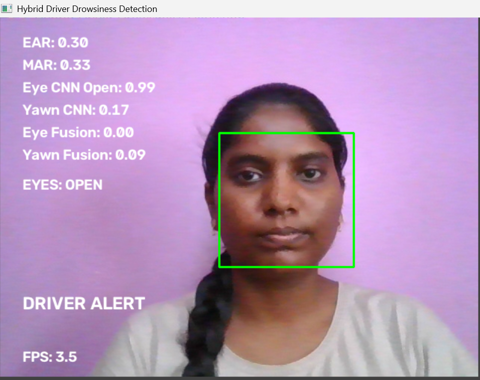
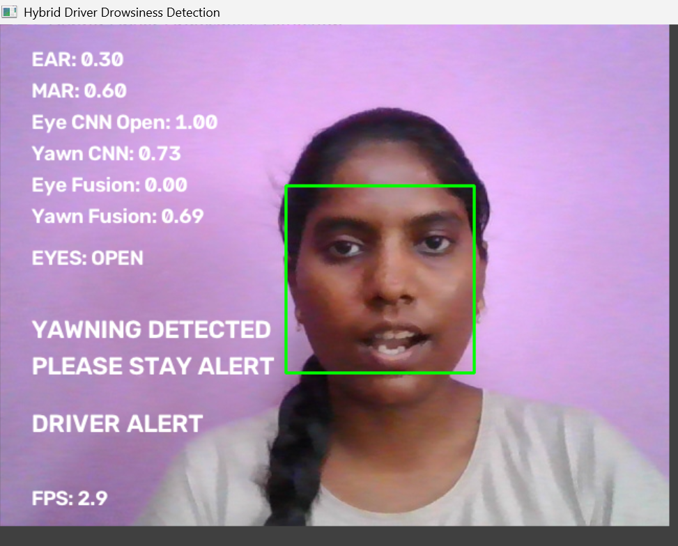
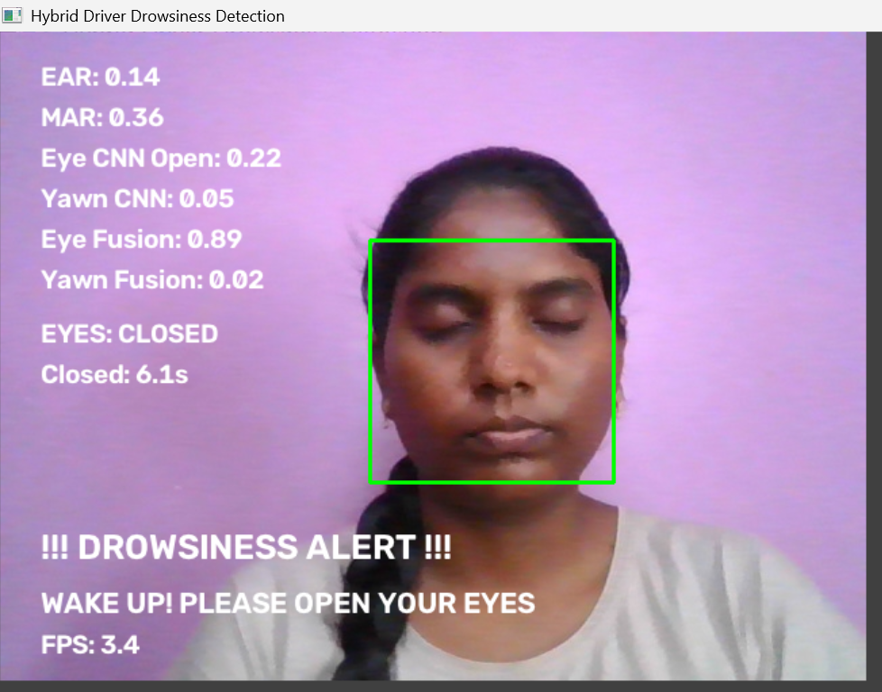

# Hybrid Driver Drowsiness Detection System

A real-time driver drowsiness detection system that combines facial geometry, deep learning, hybrid decision fusion, temporal analysis, and an audio alert mechanism.

The system monitors a driver's eyes and mouth through a webcam and detects prolonged eye closure and yawning. It combines traditional facial landmark features with MobileNetV2-based CNN predictions to improve the robustness of the detection pipeline.

## Features

* Real-time webcam-based monitoring
* 68-point facial landmark detection using dlib
* Eye Aspect Ratio (EAR) for eye-closure analysis
* Mouth Aspect Ratio (MAR) for yawn analysis
* MobileNetV2 CNN for eye-state classification
* MobileNetV2 CNN for yawn classification
* Hybrid fusion of geometric and CNN predictions
* Temporal analysis to reduce false alerts
* Audio alarm for prolonged eye closure
* Visual warning for yawning
* Automatic alarm recovery after continuous eye opening
* Optimized CNN inference using batched eye prediction and frame skipping
* Performance benchmarking

## System Architecture

```text
                    Webcam
                       |
                       v
              Face Detection
                  (dlib)
                       |
                       v
             68 Facial Landmarks
                 /         \
                /           \
               v             v
        Eye Landmarks     Mouth Landmarks
             |                  |
        +----+----+         +---+----+
        |         |         |        |
       EAR    Eye CNN      MAR    Yawn CNN
        |    MobileNetV2    |    MobileNetV2
        |         |         |        |
        +----+----+         +---+----+
             |                  |
        Eye Fusion          Yawn Fusion
             |                  |
             +--------+---------+
                      |
                      v
             Temporal Analysis
                      |
                      v
             Drowsiness Decision
                      |
              +-------+-------+
              |               |
              v               v
          Audio Alarm     Visual Alert
```

## Detection Pipeline

### 1. Face and Landmark Detection

The webcam frame is processed using dlib's frontal face detector and the 68-point facial landmark predictor.

The landmarks are used to extract:

* Left eye
* Right eye
* Mouth

### 2. Eye Analysis

The eye pipeline uses two complementary signals:

**Geometric signal**

Eye Aspect Ratio (EAR) is calculated from six landmarks around each eye.

**Deep-learning signal**

A MobileNetV2-based CNN predicts whether the eye is open or closed.

The two signals are combined through hybrid fusion.

### 3. Yawn Analysis

The mouth pipeline also uses two signals:

**Geometric signal**

Mouth Aspect Ratio (MAR) is calculated from the mouth landmarks.

**Deep-learning signal**

A MobileNetV2-based CNN predicts whether the mouth image represents a yawn.

The geometric and CNN predictions are combined using hybrid fusion.

### 4. Temporal Analysis

The system does not trigger a drowsiness alarm from a single frame.

Current temporal rules:

| Condition                           | Current threshold |
| ----------------------------------- | ----------------: |
| EAR baseline threshold              |              0.25 |
| MAR baseline threshold              |              0.60 |
| Eye fusion threshold                |              0.60 |
| Yawn fusion threshold               |              0.60 |
| Continuous eye closure              |         5 seconds |
| Continuous eye opening for recovery |         3 seconds |
| Continuous yawn indication          |          1 second |

These values are implementation parameters for this project and are not universal medical or safety thresholds.

### 5. Alert Mechanism

* Prolonged eye closure triggers the drowsiness alarm.
* Yawning produces a visual warning but does not trigger the audio alarm.
* The alarm stops after the system detects continuous eye opening for 3 seconds.

## Deep Learning Models

Both CNN components use transfer learning with MobileNetV2.

### Eye Model

* Architecture: MobileNetV2
* Input: 224 × 224 RGB image
* Task: Open/Closed eye classification
* Output: Binary prediction
* Model file: `models/eye_mobilenetv2.keras`

### Yawn Model

* Architecture: MobileNetV2
* Input: 224 × 224 RGB image
* Task: Yawn/No-Yawn classification
* Output: Binary prediction
* Model file: `models/yawn_mobilenetv2.keras`

## Dataset

### Eye Dataset

The eye classifier uses the MRL Eye Dataset.

The eye dataset was split using subject information encoded in the filenames so that the test set contains unseen subjects.

The eye dataset is not included in this repository.

### Yawn Dataset

The yawn classifier uses labeled yawn and no-yawn mouth images.

The available dataset did not provide complete subject identifiers suitable for a subject-independent split. Therefore, a stratified image-level train/validation/test split was used.

This limitation should be considered when interpreting the yawn model's evaluation results.

The yawn dataset is not included in this repository.

## Model Evaluation

### Eye CNN — Unseen-Subject Test Set

| Metric      | Result |
| ----------- | -----: |
| Accuracy    | 90.68% |
| Precision   | 99.57% |
| Recall      | 82.25% |
| F1 Score    | 90.09% |
| Test Images | 24,142 |

Confusion matrix:

```text
                 Predicted
               Closed   Open

Actual Closed   11662     44
Actual Open      2207  10229
```

### Yawn CNN — Test Set

| Metric      | Result |
| ----------- | -----: |
| Accuracy    | 95.21% |
| Precision   | 95.45% |
| Recall      | 95.85% |
| F1 Score    | 95.19% |
| Test Images |  1,024 |

Confusion matrix:

```text
                 Predicted
               No Yawn   Yawn

Actual No Yawn     490      28
Actual Yawn         21     485
```

## Real-Time Performance

The final optimized configuration was tested at a webcam resolution of 640 × 480.

Optimization techniques included:

* Batched left/right eye CNN inference
* CNN inference every second frame
* Cached CNN predictions on skipped frames

Measured result:

| Configuration                     |  Average FPS |
| --------------------------------- | -----------: |
| Original implementation           |     1.76 FPS |
| Batched eye CNN + every 2nd frame |     2.62 FPS |
| Final 640 × 480 configuration     | **3.42 FPS** |

The measured FPS depends on the hardware and software environment and should not be treated as a universal performance value.

## Behavioral Verification

The real-time system was tested for the following states:

### Normal State

* Eyes detected as open
* Low eye-closure fusion score
* Low yawn fusion score
* Driver remains in an alert state

### Yawning State

* High MAR
* High yawn CNN probability
* High yawn fusion score
* Visual warning displayed
* Audio alarm remains off

### Drowsiness State

* Low EAR
* Increased eye-closure fusion score
* Continuous eye closure
* Drowsiness alarm activated after 5 seconds

### Recovery State

* Continuous eye opening detected
* Recovery timer reaches 3 seconds
* Audio alarm stops

## Project Structure

```text
driver-drowsiness-detection-hybrid/
│
├── models/
│   ├── eye_mobilenetv2.keras
│   ├── eye_mobilenetv2_final.keras
│   ├── yawn_mobilenetv2.keras
│   └── yawn_mobilenetv2_final.keras
│
├── results/
│   ├── eye_accuracy_curve.png
│   ├── eye_loss_curve.png
│   ├── eye_confusion_matrix.png
│   ├── eye_confusion_matrix.csv
│   ├── eye_classification_report.txt
│   ├── eye_training_history.csv
│   ├── eye_train_split.csv
│   ├── eye_validation_split.csv
│   ├── eye_test_split.csv
│   ├── yawn_accuracy_curve.png
│   ├── yawn_loss_curve.png
│   ├── yawn_confusion_matrix.png
│   ├── yawn_confusion_matrix.csv
│   ├── yawn_classification_report.txt
│   ├── yawn_training_history.csv
│   ├── yawn_train_split.csv
│   ├── yawn_validation_split.csv
│   ├── yawn_test_split.csv
│   ├── performance_results.txt
│   └── final_results.txt
│
├── screenshots/
│   ├── normal_state.png
│   ├── yawning_detected.png
│   └── drowsiness_alert.png
│
├── src/
│   ├── alarm.py
│   ├── cnn_predictor.py
│   ├── detect_drowsiness.py
│   ├── drowsiness_logic.py
│   ├── feature_extraction.py
│   ├── hybrid_drowsiness_logic.py
│   ├── hybrid_fusion.py
│   ├── test_ear_mar.py
│   ├── test_landmarks.py
│   ├── test_temporal.py
│   ├── train_eye_model.py
│   └── train_yawn_model.py
│
├── alarm.wav
├── .gitignore
├── README.md
└── requirements.txt
```

## Installation

### 1. Clone the repository

```bash
git clone <(https://github.com/chandusri26/driver-drowsiness-detection-hybrid)>
cd driver-drowsiness-detection-hybrid
```

### 2. Create a virtual environment

```bash
python -m venv .venv
```

### 3. Activate the environment

Windows PowerShell:

```powershell
.venv\Scripts\activate
```

### 4. Install dependencies

```bash
python -m pip install -r requirements.txt
```

## Facial Landmark Model

The dlib facial landmark predictor is required to run the application.

The file:

```text
shape_predictor_68_face_landmarks.dat
```

is intentionally not included in this repository because of its size.

Obtain the compatible dlib 68-point facial landmark predictor separately and place it in the project root:

```text
driver-drowsiness-detection-hybrid/
│
├── shape_predictor_68_face_landmarks.dat
├── alarm.wav
├── models/
├── results/
└── src/
```

## Running the Application

Activate the virtual environment and run:

```powershell
python src/detect_drowsiness.py
```

The application opens the webcam and displays the detected facial measurements, CNN predictions, fusion scores, and driver state.

Press the appropriate exit key shown by the application to stop the program.

## Training the Models

### Train the Eye Model

The training script expects the eye dataset in the local `eye/` directory.

```powershell
python src/train_eye_model.py
```

### Train the Yawn Model

The training script expects the yawn dataset in the local `mouth/` directory.

```powershell
python src/train_yawn_model.py
```

The training datasets are excluded from GitHub.

## Screenshots

### Normal State



### Yawning Detected



### Drowsiness Alert



## Limitations

* The current real-time implementation achieves an average measured performance of 3.42 FPS on the development system.
* Performance depends on hardware, camera resolution, lighting, and system load.
* The yawn dataset uses an image-level stratified split rather than a subject-independent split.
* Extreme head poses, occlusions, poor lighting, and partially visible faces may reduce detection reliability.
* The system depends on successful face and landmark detection.
* The current implementation is a research/prototype system and is not a certified automotive safety system.

## Future Improvements

* Optimize face detection and landmark tracking
* Use lightweight landmark tracking between detection frames
* Explore GPU acceleration
* Export models to optimized inference formats such as TensorFlow Lite or ONNX
* Build a subject-independent yawn dataset
* Improve temporal smoothing and calibration
* Add driver-specific baseline adaptation
* Add multi-face handling
* Add event logging and historical drowsiness reports
* Develop a more optimized real-time user interface

## Technologies Used

* Python
* OpenCV
* dlib
* TensorFlow
* Keras
* MobileNetV2
* NumPy
* SciPy
* scikit-learn
* pandas
* imutils
* Computer Vision
* Deep Learning
* Transfer Learning

## Disclaimer

This project is developed for educational and research purposes. It should not be relied upon as the sole mechanism for determining driver fitness or preventing vehicle accidents.

## Disclaimer

Garika Chandu Sri
